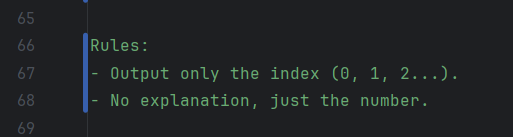
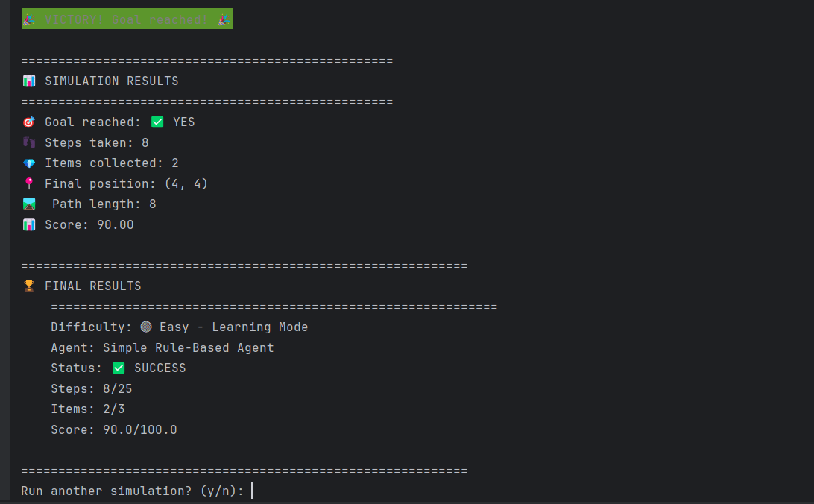
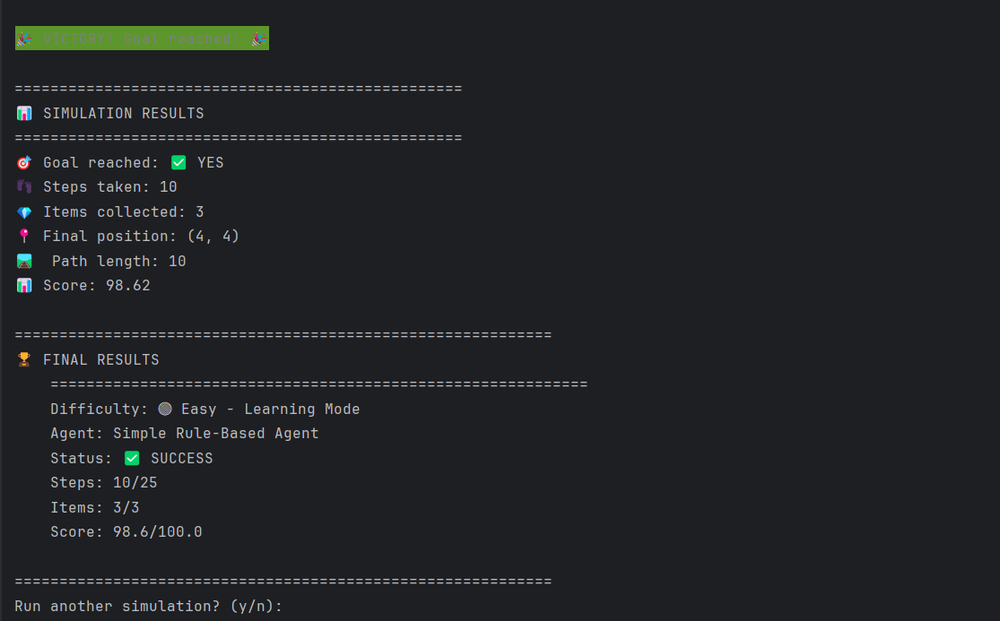
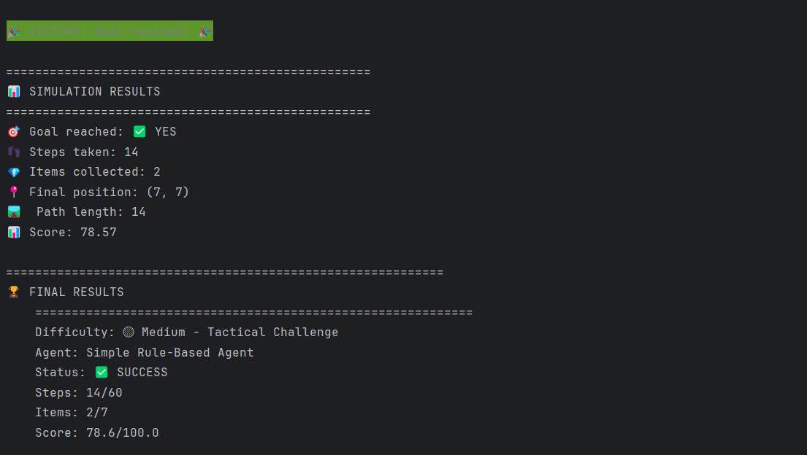
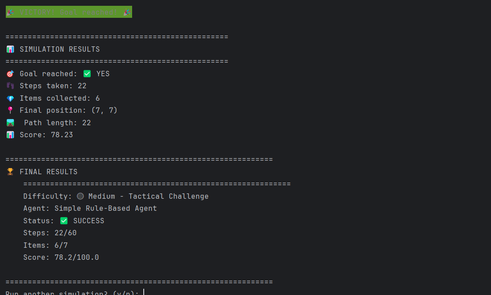
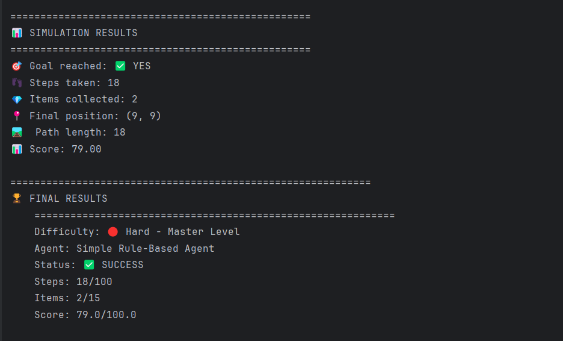
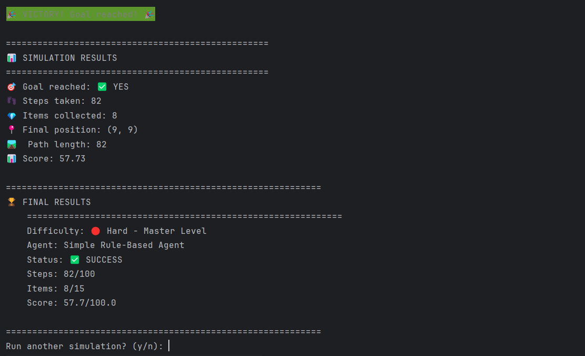

Submission for the agentic home assignment.

# Table of Contents

1. [Getting Started](#getting-started)
   - [Prerequisites](#prerequisites)
   - [Installation](#installation)
   - [Gemini API Key](#gemini-api-key)
   - [Running Local LLM with Ollama](#running-local-llm-with-ollama)
   - [Test the llama API endpoint](#test-the-llama-api-endpoint)
   - [Running the Agent](#running-the-agent)

2. [Project Structure](#project-structure)

3. [Approach](#approach)
   - [Simplest approach](#simplest-approach)
   - [Pre-compute and have the LLM use addition information](#pre-compute-and-have-the-llm-use-addition-information)
   - [A proper agent](#a-proper-agent)
   - [Clarifying questions](#clarifying-questions)
   - [Starting out](#starting-out)
   - [Prompt examples](#prompt-examples)
   - [Gemini](#gemini)

4. [Design decisions](#design-decisions)
   - [Fallback agent](#fallback-agent)
   - [LLMs](#llms)

5. [Performance comparison](#performance-comparison)
   - [Easy Difficulty](#easy-difficulty)
   - [Medium Difficulty](#medium-difficulty)
   - [Hard Difficulty](#hard-difficulty)

6. [Further Features or Improvements](#further-features-or-improvements)
   - [Getting Stuck Detection](#getting-stuck-detection)
   - [Function Calling Integration](#function-calling-integration)
   - [Memory Systems](#memory-systems)
   - [Multiple LLM Agents with Separate Histories](#multiple-llm-agents-with-separate-histories)
   - [Dynamic Context Summarization](#dynamic-context-summarization)

## Getting Started

### Prerequisites
- Python 3.8-3.11
- Docker (for Ollama/TinyLlama)
- Gemini API Key (optional, and highly recommended)
- Required dependencies (install via requirements.txt)

### Installation

#### Linux/Mac:
```bash
python -m venv .venv
source .venv/bin/activate       
cd agentic-home-assignment
pip install -r requirements.txt
```

#### Windows:
```cmd
python -m venv .venv
.venv\Scripts\activate
cd agentic-home-assignment
pip install -r requirements.txt
```

### Gemini API Key

The LLM agent can optionally use Google's Gemini API for improved performance (and speed on some machines).

To set up the Gemini API key:

1. Copy the example environment file: rename `.env.example` to `.env`
2. Replace `KEY` in the file with your actual Gemini API key
3. The format should be: `GEMINI_API_KEY=your_actual_api_key_here`

**Note**: The Gemini API key is recommended but optional. The agent will automatically fall back to the local TinyLlama model if no valid API key is found.

### Running Local LLM with Ollama

**This assignment is designed and must work with Ollama and TinyLlama.** For development and testing, you'll run a lightweight LLM locally using Docker and Ollama:

```bash
# Pull and run Ollama with TinyLlama model
docker run -d -v ollama:/root/.ollama -p 11434:11434 --name ollama ollama/ollama

# Pull the TinyLlama model (lightweight, good for testing)
docker exec -it ollama ollama pull tinyllama
```

### Test the llama API endpoint

**Linux/Mac:**
```bash
curl http://localhost:11434/api/generate -d '{
  "model": "tinyllama",
  "prompt": "Hello, world!",
  "stream": false
}'
```

**Windows (PowerShell):**
```powershell
Invoke-RestMethod -Uri "http://localhost:11434/api/generate" -Method Post -ContentType "application/json" -Body '{"model": "tinyllama", "prompt": "Hello, world!", "stream": false}'
```

**Windows (CMD with curl):**
```cmd
curl http://localhost:11434/api/generate -d "{\"model\": \"tinyllama\", \"prompt\": \"Hello, world!\", \"stream\": false}" -H "Content-Type: application/json"
```

### Running the Agent

To see the baseline implementation in action:

```bash
python main.py
```

This will:
1. Show you agent selection and difficulty selection menus
2. Let you choose between Easy, Medium, or Hard
3. Run the Simple Rule-Based Agent (or your LLM agent)
4. Display the results and scoring

## Project Structure

```
agentic-home-assignment/
├── assets/                         # Asset files (images, configs, etc.)
├── src/
│   ├── agent/
│   │   ├── base_agent.py          # Abstract base class for all agents
│   │   ├── llm_agent.py           # LLM-powered agent with fallback logic
│   │   └── simple_agent.py        # Simple rule-based baseline agent
│   ├── environment/
│   │   └── [environment files]    # Grid world, entities, game logic
│   ├── llm/
│   │   ├── gemini_llm.py          # Google Gemini API implementation
│   │   ├── llm_interface.py       # Abstract class for LLM providers
│   │   └── tiny_llama_llm.py      # Ollama TinyLlama local implementation
│   └── simulation/
│       └── [simulation files]     # Simulators, scoring, game loop
├── .env                           # Environment variables (API keys)
├── main.py                        # Main entry point and CLI interface
├── README.md                      # Original assignment instructions
├── README2.md                     # Additional documentation/notes
└── requirements.txt               # Python dependencies
```

## Approach

Due to the issues with the consistency of the models, I chose to write the *Approach* section in a more "explanatory" style,
as I believe there's also some value in the process.

---
After reading through the README and running the demo, I identified three distinct strategies:

### Simplest approach
Instruct the LLM to aim to collect items and reach the goal efficiently in a generic way, while warning him from common pitfalls and trying to balance its risk tolerance.
This is the naive and simplest approach, all it required is a good prompt.

### Pre-compute and have the LLM use addition information
Offload most of the calculation to standard algorithms and have the LLM take the calculation result and use it for decision-making.
One of possibility was to use multi-source BFS, which would allow to calculate the shortest distance between each two items, and then let the LLM determine the order of items needed to be collected while prioritizing clusters and avoiding long corridors for minimal reward if it comes at the cost of efficiency.
Another direction would be to use an algorithm to find clusters, and perform a similar operation, but this one is vulnerable to adversarial cases were the placement of two items is close to each other, but the actual distance is much larger due to blockades.
I determined that this is more on the algorithmic side and was not the goal of the assignment.

### A proper agent
Build A more “sophisticated” agent, where the LLM takes high level strategy decision, stores them “in memory” (a list containing previous knowledge and decisions gathered in previous steps, allowing the LLM to , and in each step the LLM would evaluate the strategy and update the memory accordingly. In addition, functions like “think”,  “observe”, etc., can be used, and implemented using libraries to invoke function calls directly from the LLM's instructions, but since I have yet to had a chance to try these, I won't be using them :)

### Clarifying questions
Considering the 3 options, I was under the impression that simplest solution may be *too* simple for the assignment, pre-computing requires the information that the agent did not have access to, and the third option had low chance of working well when using a smaller model, as they tend to hallucinate and their mistakes propagate and corrupt the memory.

As all 3 options are vastly different from each other, I left like I had to ask some clarifying questions, to determine what direction would be more in-line with the expectations. Since I already had a general idea of how to execute each of the options, all I needed was to determine which ones to eliminate, which is why I decided to keep my questions on the technical side.

Some of the questions I asked were:
1. Can the information the agent has access to be modified? (e.g., accessing the max step, having access to the dimensions of the grid)
2. Do all decisions need to be made by the LLMs? Can there still be “rule-based decisions” (i.e., if an attempt to reach an item would lead in not reaching the goal in the required step, go straight to the goal)?
3. Does the balance between the “greediness” of the decisions need to be numerically calculated or should the LLM reach decisions by itself?

After speaking with Oded, it seemed that I could cross out the algorithmic approach as I thought. Additionally, from the conversion I was under the impression that the got satisfactory results with relatively simple approach, short prompt, etc., so I decided to start working towards the simplest approach, and if the model could handle it, I would add a memory function and maybe some functions to access and edit memory.

In this case, since all decisions are made by the LLM and the scoring method is not known (the function is, but the weights are not), the LLM would have a general idea of how its scored but without giving it actual numeric values.

### Starting out
The idea is as follows:
- Extract the information from `grid_info`
- Build a prompt out of the information and the possible moves, with generic instruction that explains the task at hand, gives the current state, and warns it from common pitfalls.
- Extract the result from the response.

My mistake was to start with a relatively large prompt and work my way down. Even the tiny model was not very fast on my machine, and trial and error with the prompt took more time than it should have.
This was a problem, because it seemed that the small model could not handle any prompt well, not even the simple ones.

### Prompt examples

#### A more specific prompt that would probably work with a larger model
```
<instructions>
You are an intelligent agent that can navigate through a grid-based world. Your goal is to collect items, and reach a target goal efficiently.
</instructions>

<priorities>
1. Balance item collection vs goal completion based on progress
2. Prioritize HIGH CONCENTRATION item areas
3. Avoid deadends or obstacles that make items appear close but actually require long detours
</priorities>

<state>
Agent: {agent_pos} | Goal: {goal_pos} | Distance to goal: {goal_distance}
Items available: {items}
Items collected: {items_collected}
Steps taken so far: {steps_taken}
Possible moves: {possible_moves}
Obstacles: {obstacles}
</state>

In your reply, explain your reasoning and your strategy.
the best move should be wrapped in the tags <response>MOVE</response>

Example:
My reasoning:

My strategy:

<response>
(x,y)
</response>
```
As mentioned, this prompt was way too complicated for the smaller model.

#### Relatively simple
```
You are playing a grid game. Choose the best move.
GOAL: Get the highest score by collecting items and reaching the goal efficiently.

CURRENT STATE:
- You are at: {agent_pos}
- Goal is at: {goal_pos}
- Items location: {items}
- Items collected: {items_collected}/{items_total}
- Obstacles to avoid: {obstacles}

YOUR OPTIONS:
{moves_str}

INSTRUCTIONS:
1. Collect items when possible
2. Move toward the goal
3. Avoid obstacles
4. Choose efficiently

Answer with: <move>NUMBER</move>"""
```
The LLM was very indecisive, was either stuck in a loop between going back and forth, or essentially making random moves. 

#### Very simple
```
Your task is to reach the goal.
Current location: {agent_pos}
Goal location: {goal_pos}
Possible moves: {moves_str}

respond only with the best move, without any additional information
```
I attempted to use several prompts like these, the agent managed to reach the goal, but often disregarded items completely (understandably).

Some of the things I have attempted:
- Giving limited access to the obstacles or items (only ones that are close enough to the agent)
- Giving instructions wrapped in XML tags
- Asking the LLM to respond in tags
- Asking the LLM to explain his reasoning before returning the result
- Asking it to return the result without any explanation
- Changing the options in the query itself (temperature, top_p, top_k, number of tokens)
- Numbering the possible moves and asking for the index\move number instead of the move itself
- Instructing as a system prompt

The issues I have encountered were that unless the prompt was very simple, the LLM would "mirror" the prompt back to me, making accessing the actual response very hard to access (as it completely disregarded replying tags).
Additionally, when explaining what it knows (which it did even if instructed to avoid explaining), it kept confusing what it knows - it often assumed its origin is the goal state, or completely ignored the possible moves and attempted to jump around by more than a single step.

In my experience, no matter how small the prompt was, these two images sums up the experience:

<table style="width: 100%; max-width: 600px;">
<tr>
<td>

</td>
</tr>
<tr>
<td>

</td>
</tr>
<tr>
<td>
And about 70% of the times, the index number is incorrect anyways</td>
</tr>
</table>

### Gemini
At a certain point I felt that this is not a good use of the time I had left, and that I need to move on, as every query took 10-20 seconds to work and the results were not satisfactory regardless of what I did.
Oded mentioned he was able to get good results with the TinyLlama model, and I'm extremely curious to see what I could have done differently :)

I knew that Gemini had some limited free API keys for a rate limited model, so I moved on to use Gemini over the llama one. This is not a one-to-one comparison, as the model is better than TinyLlama, but it is still one of the quick, cheaper ones.


* I later find the rate limits too restricting, so I changed the key and added it to an .env file that I will send separately. The model is **worse** than the one on the free trial, but faster.  

* Its worth saying that any API key you see in GitHub is easily generated, free and limited, easily disabled, and on an unpaid account, which is why I felt comfortable inserting it to the code.

After swapping to Gemini so that I could continue (way too late in the process), I attempted to implement the simplest approach, and took elements from the more complicated one as I went.

---

With the Gemini model working better (though not always correct), I let him explain his reasoning, which allowed for much better debugging of the prompt.

More specific prompting considerations:
- It was clear he is very risk-averse, and since Oded mentioned the step limit was more as a fail-safe for the simulator (though I'm sure there are tests for such cases that it will fail on), I asked him the model to be relatively greedy.
- As explained before, since we cannot know the exact weighting of the rewards, I did let him know how he was evaluated, but without giving it the actual numeric values.
- In the end, I did decide to keep track of the previous steps in attempt to avoid the unnecessary backtracking

After that, I quickly got good results for the easy maze, and moved on to the medium and the hard mazes.
The agent had a problem dead ends or corners due to changing its mind few steps, which leads to back-tracking indefinitely.
After further adjustments, the agent is able to release itself from most of these and advance to different parts of the mazes relatively quickly.

I attempted to add several mechanisms, some of which worked better or more consistently than others.
For the sake of brevity, I'll quickly mention some of the methods that worked better:

- Adding context that contains the 5 previous moves helped the agent release itself from back tracks, and stay on 
previously selected target.
- On weaker models, changing how the possible moves are written improved predictability and reproducibility of responses.
- Analyzing cells around the potential moves sometimes helped with avoiding obstacles sometimes. I ended up commenting it one, but it has potential to be tuned.

## Design decisions

### Fallback agent
Initially, I used inheritance to leverage the SimpleAgent's `decide_move()` method as a fallback, despite inheritance not always being the most developer-friendly approach. Given the small scope of this assignment, this seemed acceptable. Later, I refactored to pass the fallback agent as an optional parameter with SimpleAgent as the default, which provides more flexibility for using different fallback strategies.
### LLMs
Once the logic grew a bit, I decided to refactor out the LLM provider, as it is different from the actual "business logic", which is especially useful under the circumstances where i used a different model than the tiny llama one.
This makes it easy to swap out the LLM "engine", while keeping the functionality of the agent the same.
And I tied it up with an abstract class (I called it an interface as it has no functionality of its own)

The LLM agent attempts to use a provider received as a parameter, if none were found then it will attempt to use the Gemini one, and if it fails, it will attempt to use the tiny llama one.


## Performance comparison

### Easy Difficulty
<table>
<tr>
<td>

**Simple Agent:**


</td>
<td>

**LLM Agent:**


</td>
</tr>
</table>
As we can see, the simple missed an item, while the LLM one was relatively efficient, as the maze was simple and without any pitfalls.

### Medium Difficulty
<table>
<tr>
<td>

**Simple Agent:**


</td>
<td>

**LLM Agent:**


</td>
</tr>
</table>

In the medium difficulty, we can see that the simple agent had missed a lot of items, but was relatively quick. On the other hand, and while the LLM agent collected more items, it took more steps.
This is both due to item prioritization, but also due to it making unnecessary\repeating moves. 

### Hard Difficulty
<table>
<tr>
<td>

**Simple Agent:**


</td>
<td>

**LLM Agent:**


</td>
</tr>
</table>

Here we can see a large difference between the two. The LLM agent could not beat the simple one, due to over prioritizing the cluster at the top.
while it did collect more items, it took many more steps, which negated the benefit.

In summary, the LLM agent successfully reached the goal across all difficulty levels.
Performance relative to the baseline varied: it outperformed the simple agent on easy difficulty, achieved comparable 
results on medium difficulty, but underperformed on hard difficulty.

Fine-tuning the balance between item collection and goal efficiency remains challenging without access to the exact scoring weights.

## Further Features or Improvements

Overall, the results of the LLM agent can certainly be improved.
These are the techniques or methods I thought of that can be used to further extend or improve the capabilities of the agent:

### Getting Stuck Detection
As mentioned, the agent can get stuck going back and forth between the same positions, creating inefficient oscillating patterns.
When such patterns are identified, the agent can implement escape strategies such as exploring previously unexplored directions or taking deliberate random moves to break free from the loop.
Additionally, the decision-making process can incorporate penalties for revisiting recently visited positions, naturally encouraging exploration of new areas.
Knowing how the system is scored can help us adjust the system much better (again, it's in the code but then the code would not be 'generic' as requested).

### Function Calling Integration
The agent can use LLM function calling capabilities for more structured interactions.
This involves defining specific functions for movement decisions and planning operations, allowing the LLM to call these directly for more reliable and precise control over the agent's behavior.

### Memory Systems
Implementing persistent memory can significantly improve decision-making both within episodes and across multiple runs. Working memory would store visited positions, failed attempts, and successful strategies during a single episode, while long-term memory could maintain performance data across episodes to learn from experience.

### Multiple LLM Agents with Separate Histories
Using specialized LLM instances for different aspects of the problem can improve overall performance through division of cognitive labor.
A planner agent would maintain high-level strategy by analyzing the full grid and setting objectives, while an executor agent would handle immediate move decisions based on the current local situation.
Each agent maintains its own conversation history tailored to its specific role, with the planner providing strategic guidance and the executor reporting progress back.

### Dynamic Context Summarization
Instead of presenting the 5 last messages, the agent can create and continuously update a coherent summary of its current understanding and strategy.
This living document would be refreshed each step with new information such as items collected, obstacles discovered, and progress toward the goal, while replacing outdated details with current insights.

---

Implementing should not take that much time, and at the beginning I actually wanted to attempt to use some of these, 
but due to the model choice, implementing each one would require extensive and separate testing and tuning of each one, just to know what the model can handle. 
